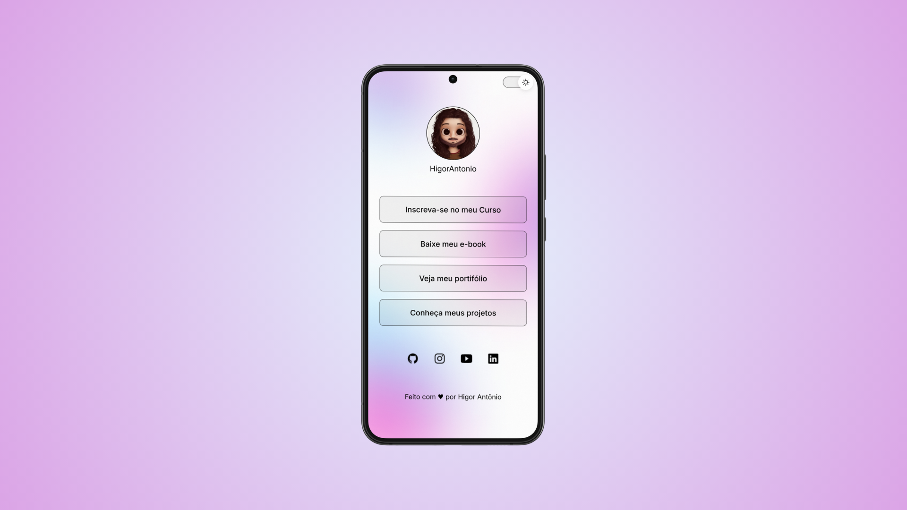
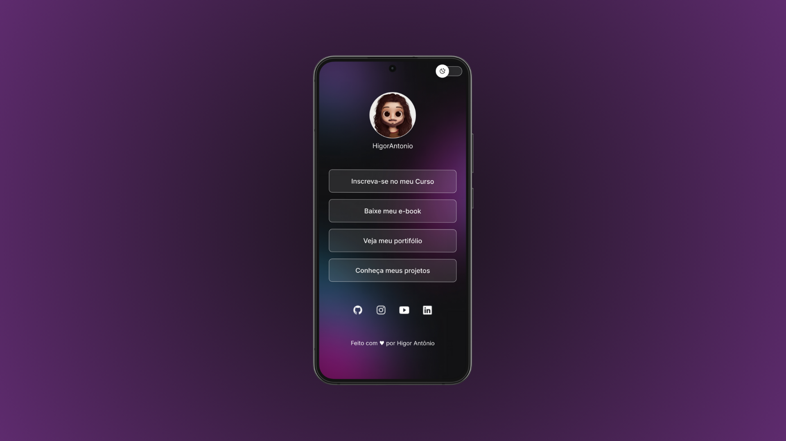
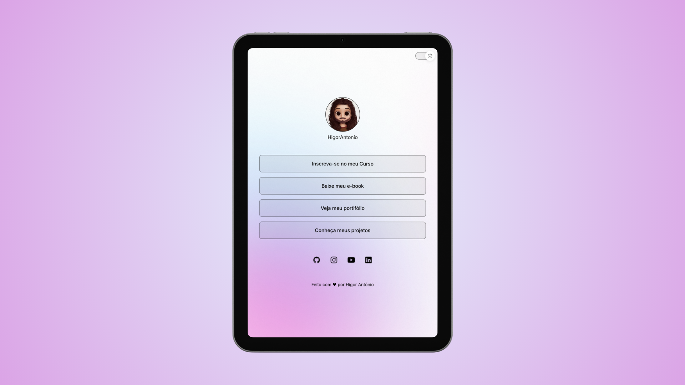
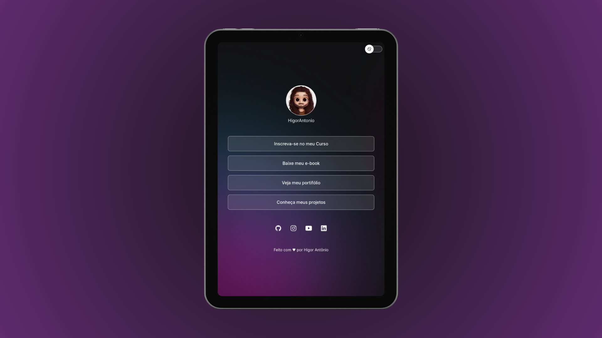
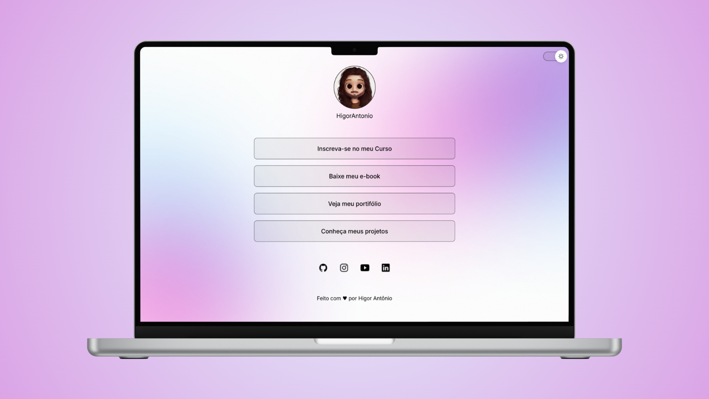
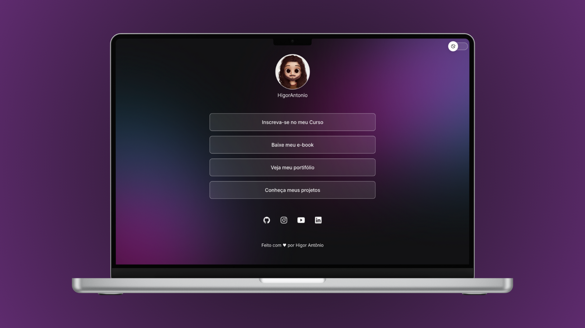
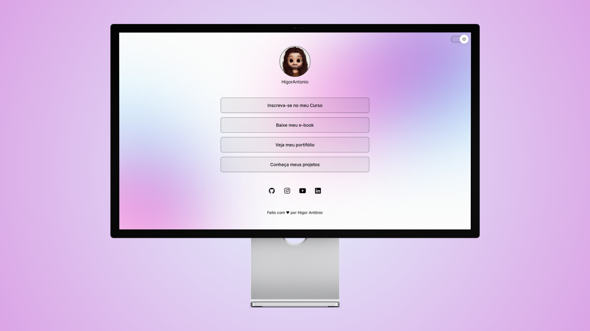
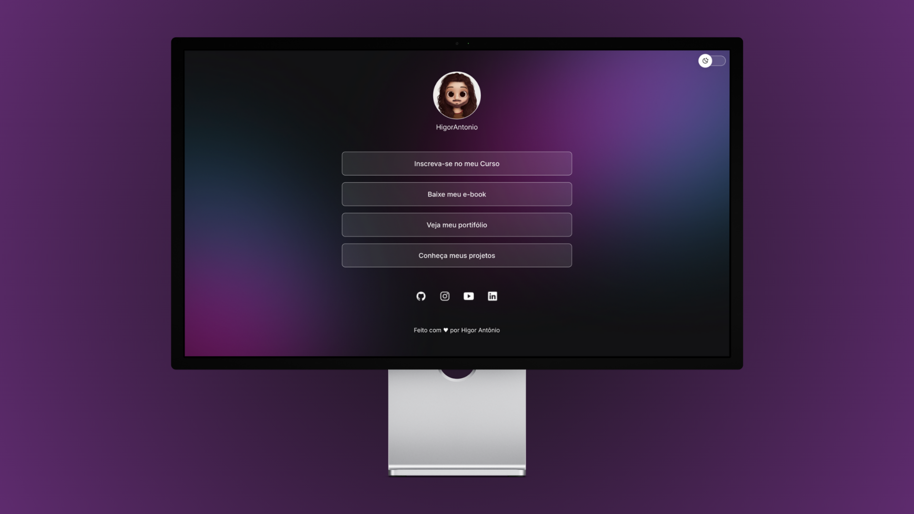

# Agregador de links pessoais

## 📌 Sobre o Projeto
Este projeto é uma landing page responsiva criada utilizando **HTML, CSS e JavaScript**.

## 🌐 Acesse o Projeto
🔗 [Clique aqui para visualizar a página online](https://higorantonio.github.io/personal-link-aggregator/)

## 🚀 Tecnologias Utilizadas
- **HTML5**
- **CSS3**
- **JavaScript**

## 📸 Capturas de Tela

